# Domaći Projekat II (Kozmetičke epruvete)

Hardverske komponente korišćene u izradi projekta :

-STM32F103C6
-ULN2803A
-LM35 (Temperaturni senzor)
-ABLS-8.000MHZ-B4-T (Kristalni oscilator 8MHz)
-DP-708 (2 Drajvera za koračne motore)

Za komponentu ULN2803A sam se odlučio iz razloga što se aktivna vrednost ulaznih pinova nalazi u opsegu bliskom 3V (Kolektorska struja Ic=300mA). Za temperaturni senzor sam se odlučio iz praktičnih razloga, dovoljno je dovesti Vout signal pravo na pin mikrokontrolera koji je konfigurisan kao ADC kanal. Ostale komponente sam birao po principu FCFS(First come first serve). 

Sve napone napajanja na šemi sam prilagodio datasheetovima-a odgovarajućih komponenti. 

Pinovi mikrokontrolera STM32F103C6 korišćeni u realizaciji kao i konfiguracija takta :

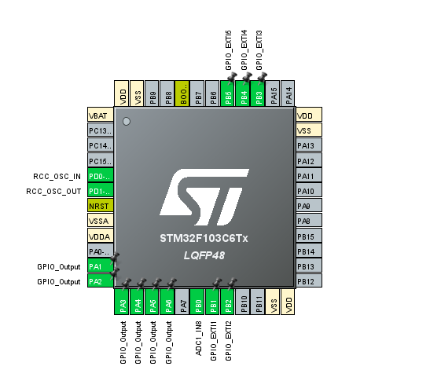

Izlazni pinovi namenjeni drajverima motora:
-PA1  (Pulsni signal namenjen drajveru motora 1)
-PA2  (Signal smera okretanja namenjen drajveru motora 1)
-PA3  (Enable signal namenjen drajveru motora 1)
-PA4  (Pulsni signal namenjen drajveru motora 2)
-PA5  (Signal smera okretanja namenjen drajveru motora 2)
-PA6  (Enable signal namenjen drajveru motora 2)

Ulazni pinovi konfigurisani tako da reaguju na prekide po očitanoj uzlaznoj ivici:
-PB1 (Pritiskom korisnik se odlučuje za epruvetu labelisanu nulom)
-PB2 (Pritiskom korisnik se odlučuje za epruvetu labelisanu jedinicom)
-PB3 (Pritiskom korisnik se odlučuje za epruvetu labelisanu dvojkom)
-PB4 (Pritiskom korisnik se odlučuje za epruvetu labelisanu trojkom)
-PB5 (Pritiskom korisnik se odlučuje za epruvetu labelisanu četvorkom)

*Napomena: Korisnik može promeniti trenutno podešenu epruvetu, čak i tokom procesa traženja prethodne (Okretanja cilindra sa epruvetama)

Pinovi korišćeni za eksterni takt visoke brzine (8MHz):
-OSCIN_PD0
-OSCOUT_PD1

Pin konfigurisan kao kanal 8 analogno digitalnog konvertora 1:
-PB0

2 Tajmera:
- Jedan (TIM2) konfigurisan da generiše impulse svakih 5 μs (Minimalna dužina visokog , kao i niskog naponskog nivoa navedena u datasheet-u korišćenog drajvera koračnog motora)
-Radi u režimu internog takta, sa frekvencijom 32 MHz , vrednosti prescaler-a kao i autoreload registra su:
    pre=160
    arr=1

-Drugi (TIM3) je konfigurisan da diktira periodu AD konverzije, svake 2 sekunde
-Radi u režimu internog takta, sa frekvencijom 32 MHz , vrednosti prescaler-a kao i autoreload registra su:
    pre=10000
    arr=6400

Pojašnjenje firmware-a:

-Glavni deo programa je implementiran na principu mašine konačnih stanja:

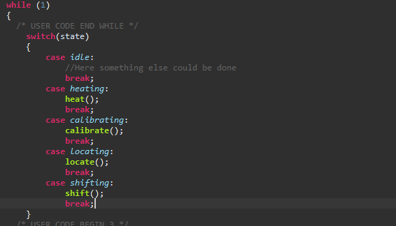

Za ovakav algoritam sam se odlučio iz razloga što kada se mašina nalazi u idle stanju moguće je izvršavati druge poslove. To nije slučaj samo za idle stanje, moguće je efikasnije koristiti i druga stanja jer se većina koda izvršava tek po opsluženom prekidu. 

Promenljiva state nabrojivog tipa:

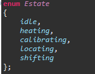

Menja stanja shodno shodno završenim poslovima prethodnih etapa.

Ceo sistem se pokreće tek nakon što se korisnik, pritiskom na jedan od 5 tastera, odluči za neku epruvetu. Korisnik može menjati svoj izbor dok se izvršava bilo koji drugi deo programa. Prvim pritiskom postavlja se vrednost promenljive epr na odgovarajuću, i menja se stanje na heating (Režim rada gde će se motor 1 okretati sve dok se ne dostigne željena temperatura). Čitava logika tog režima nalazi se u funkciji locate():
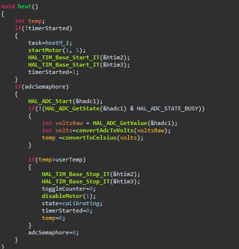

Promenljiva timerStarted je semafor, koji indicira da li je su pokrenuti tajmeri koji se koriste u ovoj etapi, koji rade u brojačkom režimu. Promenljiva task je nabrojivog tipa i ona indicira u kom režimu, i koji motor će raditi u prekidnoj rutini koja se poziva po isteku određenog vremenskog intervala. Pokreće se motor jedan sa smerom okretanja "1" pozivom funkcije startMotor(): 

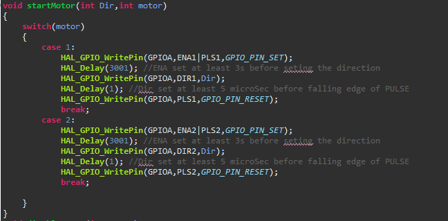

Kao argumenti joj se prosledjuju željeni motor (1 ili 2), kao i smer njegovog okretanja. Motor se pokreće kao što je navedeno u datasheet-u korišcenog drajvera: 

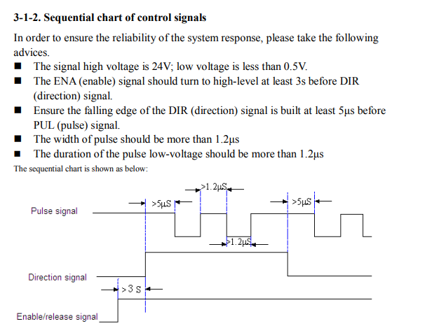

Sadržaj funkcije HAL_TIM_PeriodElapsedCallback(TIM_HandleTypeDef *htim), koja se poziva po generisanom prekidu sa jednog od aktiviranih tajmera po isteku odgovarajućeg intervala, je podeljen na više delova, shodno tajmeru sa kojeg stiže prekid. 

Na slici se nalaze svi moguci režimi rada motora 1, koje određuje promenljiva task. U ovaj deo funkcije se ulazi po isteku 5 μs, što je najmanja moguća dužina trajanja visokog ili niskog naponskog nivoa navedena u datasheet-u (Videti vremenski dijagram signala).

Promenljive toggleCounter i position se koriste za pracenje pozicije motora 1, u odnosu na početnu, za koju se pretpostavilo da se nalazi na mestu prvog člana niza sa epruvetama. Pozicija se menja tek nakon isteka jedne periode pulsnog signala (jedan korak (uslov toggleCounter%2==0)).

Za deo funkcije heat() koji se odnosi na AD konverziju  zadužen je tajmer 3 koji će na svake 2 sekunde postaviti vrednost adcSemaphore na 1, čime će se omogućiti čitanje vrednosti koja se trenutno nalazi na pinu na koji je konektovan LM35. 

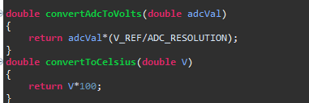

Na gore datoj slici se nalaze dve funkcije za konverziju vrednosti, koja je očitana na kanalu 8, u vrednost napona koji pročitana vrednost predstavlja. Formula za pretvaranje napona u temperaturu koja je navedena u datasheet-u LM35 senzora nalaže da se napon očitan u milivoltima podeli sa 10 kako bi se dobila vrednost temperature u celzijusima, što odgovara množenju napona u voltima sa 100. 

Kada nakon određenog vremena temperatura dostigne vrednost definisanu u programu (broj_slova_ImePrezime*5) zaustavlja se rad motora, kao i oba tajmera, i vrednost promenljive state se menja. 

Calibrate() funkcija je odgovorna za vraćanje točka u početnu poziciju najkraćom mogućom putanjom u odnosu na trenutnu vrednost position promenljive. 

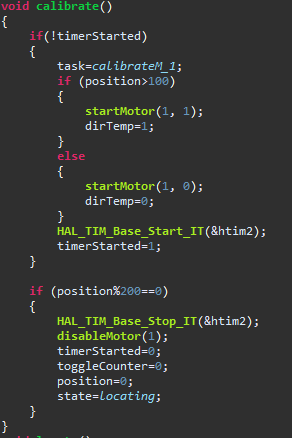

Zadatak koji će se obavljati u okviru prekidne rutine tajmera 2 se menja u calibrateM1, proverava se kojim smerom okretanja će se prvo dostići početna pozicija točka, shodno tome se aktivira motor1 u jednom od odgovarajućih pravaca. Pulsevi će se generisati sve do trenutka kada position%200==0; (Kako je u datasheetu navedeno da je jedan pomeraj koračnog motora 1,8 stepeni, to znači da je za pun okret potrebno 200 koraka). Kada se dostigne početna pozicija zaustavlja se rad motora 1 kao i tajmera 2 i prelazi se na traženje najbliže korisnički zadate epruvete (state=locate).

Funkcija locate() pronalazi epruvetu na najkraćem rastojanju od trenutne pozicije, pozivom funkcije findClosest(), čija implementacija možda nije najefikasnija ali je autentična. 

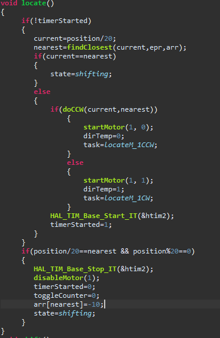

Nakon pronađene najbliže eprubete, funkcija doCCW() odlučuje da li pokrenuti motor 1 u smeru obrnutom od kretanja kazaljke na satu (Counterclockwise) ili u smeru kretanja (Clockwise). Shodno toj odluci se motor 1 pokreće sa odgovarajućim smerom, a zadatak koji će se izvršavati u prekidnoj rutini tajmera 2 se podešava analogno tome. Kada se dostigne pozicija najbliže tražene epruvete motor 1 se zaustavlja, kao i tajmer 2, i prelazi se u režim rada gde će motorom 2 biti upravljano tako da epruvetu izbaci iz cilindra. 

Funkcija shift() zadužena je za taj deo posla:

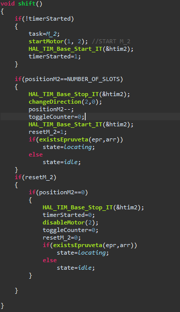

Na pulsni signal drajvera motora 2 će stići onoliko impulsa kolika je dužina trake koja se pomera (5 mm jedan korak => NUMBER_OF_SLOTS= 10 koraka = 50 mm). Po izbačenoj epruveti, motor 2 se zaustavlja (promenljiva position2 je dostigla maksimalnu poziciju), menja se smer okretanja, funkcijom changeDirection, shodno datasheet-u korišćenog drajvera motora i sada će prekidna rutina tajmera 2 generisati signal tako da se motor 2 vrati u početno stanje. Kada se završi celokupan proces, zaustavlja se motor 2, prelazi se na pretragu za narednom najbližom epruvetom, ukoliko ona i dalje postoji u cilindru, a ukoliko su sve epruvete izbačene, program se vraća u stanje idle iz koga se može izaći pritiskom na relevatno korisničko dugme, i naravno ako još uvek postoji epruveta koja odgovara pritisnutom dugmetu. 

Opis pojedinih funkcija je izostavljen jer  je njihova implementacija ili trivijalna, ili nije u direktnoj korelaciji sa predmetom Mikroproceosrski sitemi. 

Slika konfiguracije takta:

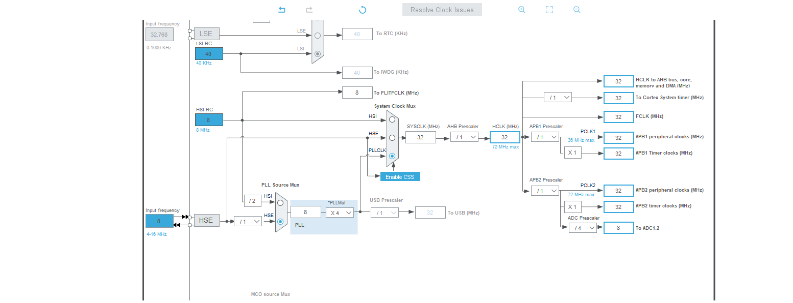

